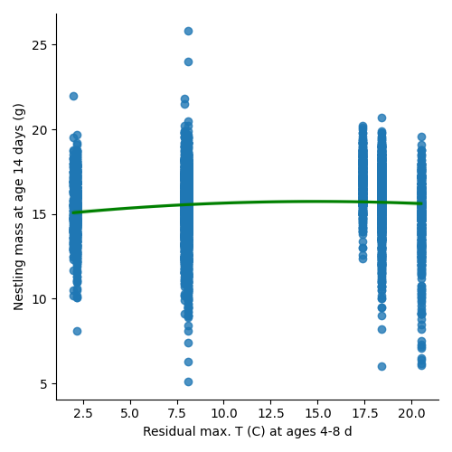

# Replicating Great Tits Weather Study
I am replicating the following study: "Weather effects on nestling survival of great tits vary according to the developmental stage" conducted by:
Fernando Marques-Santos, Universidade Federal de Minas Gerais and
Niels J. Dingemanse,  Ludwig Maximilian University of Munich.
I am not affiliated with conducting the study or am or was a member of either university.
I am using python, pandas, and seaborn to graph the charts from Figure 2.
## Findings

### Within-year Effects

### Between-year Effects

### Within-year Effects

