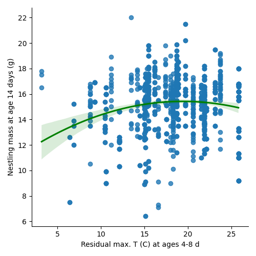
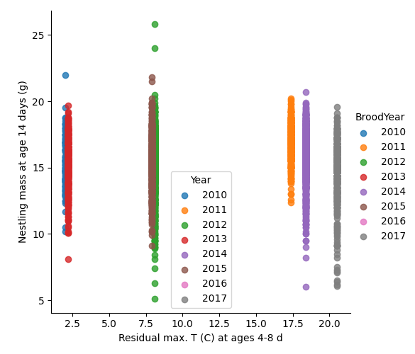
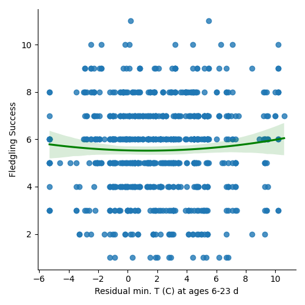
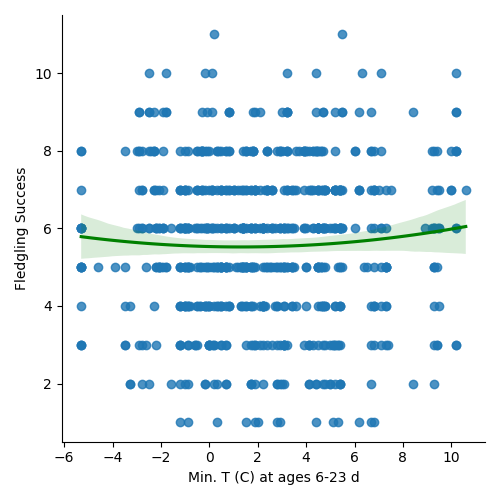

# Replicating Great Tits Weather Study
I am replicating the following study: "Weather effects on nestling survival of great tits vary according to the developmental stage" conducted by:
Fernando Marques-Santos, Universidade Federal de Minas Gerais and
Niels J. Dingemanse,  Ludwig Maximilian University of Munich.
I am not affiliated with conducting the study or am or was a member of either university.
I am using python, pandas, and seaborn to graph the charts from Figure 2. https://onlinelibrary.wiley.com/doi/epdf/10.1111/jav.02421

The study examined how reproductive characteristics of great tits in southern Germany are influenced by temperature and precipitation during specific time periods when the nestlings are growing. Three different models were used to analyze the data for each reproductive trait. The graphs illustrate the effects of environmental variables within a single year (left column) and between different years (right column). The years are represented by varying shades of gray in the right column. The gray bands represent the 95% credible intervals. The significance of linear and squared weather parameters is indicated by whether they differ from zero or are non-significant.In graphs a and b, individual nestlings are depicted as data points, while in graphs c and d, individual nests are represented as slightly displaced points. The curves presented in the figures represent the parameters calculated for nests with seven hatchlings, which is the average population size.

## Findings

### a)
In graphs a, individual nestlings are depicted as data points.

### b)
In graph b, individual nestlings are depicted as data points.

### c)

### d)

In graphs c and d, individual nests are represented as slightly displaced points. 
